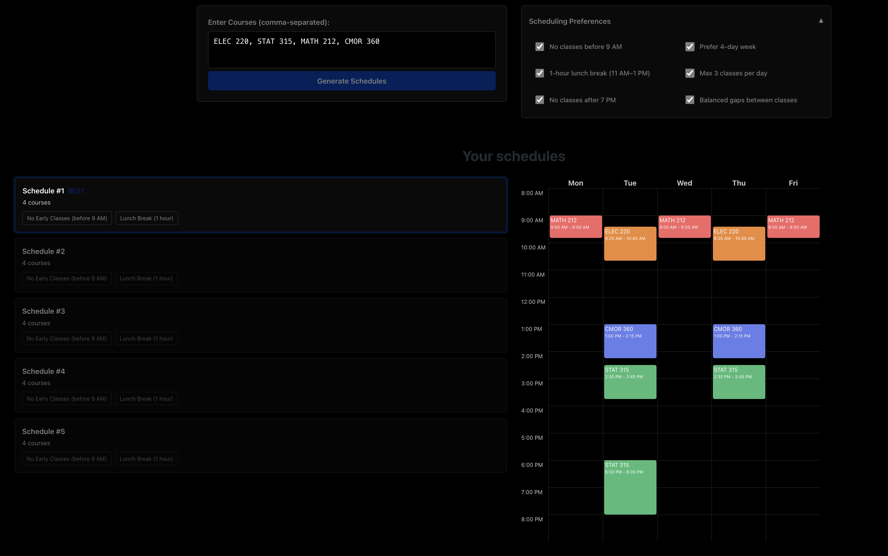

# OwlPlanner
## Overview
This is a web application that atomatically generates and ranks course schedules for Rice University students given a selection of courses, based on student preferences.

## Demo
https://owlplanner.vercel.app/


---
### Customizable Preferences
- No classes before 9 AM
- Prefer 4-day weeks
- 1-hour lunch break (11 AM–1 PM)
- Max 3 classes per day
- No classes after 7 PM
- Balanced gaps between classes

---
### Scoring System
Each schedule is ranked by weighted preferences - these weights were chosen based on my subjective experiences:
- Early class penalty: -5 pts
- 5-day week penalty: -30 pts
- Gap penalties: -5 pts (too short), -3 pts (too long)
- Lunch bonus: +10 pts
- Class density: -4 pts per extra class >2/day
- Late night penalty: -10 pts
---

## Tech Stack

**Frontend:** React 18 + Vite + CSS3 (Vercel)  
**Backend:** FastAPI + Pydantic + Python 3.12 (Render)  
**Data:** CSV with in-memory caching (~2450 courses)

---

### Run Locally

**Backend:**
```bash
cd backend
pip install -r requirements.txt
python -m uvicorn app.main:app --reload
```
---

## Previous Versions
### Version 1
- Command-line interface for schedule generation
- Automatically scrapes course data from courses.rice.edu (8 departments)
- Accepts comma-separated list of desired courses as input
- Validates course availability before processing
- Generates all valid schedules with no time conflicts
- Displays course section, CRN, instructor, and meeting times
- Option to refresh course data on each run

### Version 2
- RESTful API backend with FastAPI
- Web UI for course selection and preferences
- Automatic schedule ranking with weighted scoring algorithm
- Support for user preferences (early class penalties, gap minimization, day compactness)
- Interactive schedule visualization
- Admin endpoint for data refresh